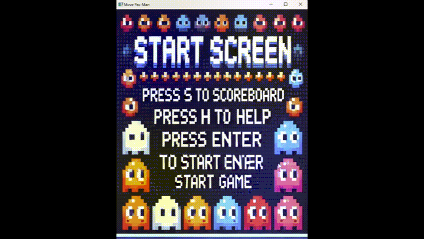

# Pacman Game (C++)

A fully playable Pac-Man game clone developed in C++ as a team project at Seoul National University.

## Demo

## Features

- Maze-based player movement and navigation
- Ghost AI with individual target-based movement logic
- Collision detection with life loss / respawn system
- Scoreboard and stage progression
- Sound effects and game UX enhancements

## Tech Stack

- C++
- Object-Oriented Programming
- Visual Studio

## What I Learned

- Designing game systems with OOP architecture
- Implementing AI movement logic and path behavior
- Managing game states, collisions, and event loops
- Delivering a runnable end-to-end software project

## Team Project Info

Seoul National University  
Programming Methodology (Prof. Hyeongseok Ko, Fall 2024)
